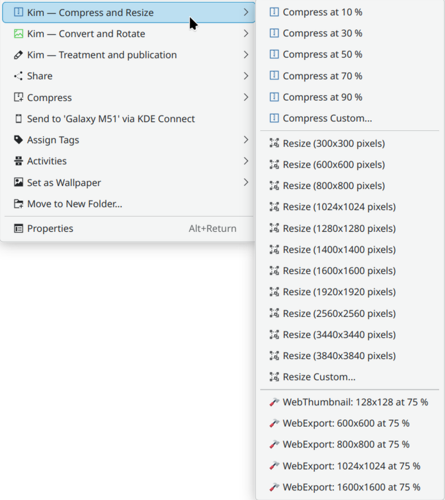

# KDE Image Menu 6 — KIM6
KIM6 is a service menu for the KDE Plasma desktop. It adds context-menu actions in Dolphin and Folder View so you can resize, convert and batch-process images (and some video formats) directly from the file manager.

KDE store link: https://store.kde.org/p/2307290/

The manual: https://kim-6.github.io/kim6/



## Dependencies, Install, Uninstall
See [INSTALL.md](INSTALL.md).

## Features

* Process images directly from Dolphin's context menu.
* Compress and resize images for web, sharing or archival.
* Convert between multiple image formats.
* Rotate, flip and losslessly manipulate images.
* Sort images based on EXIF date.
* Batch-rename images with flexible patterns.
* Create HTML galleries, collages and simple GIF animations.
* Reduce or re-encode video clips using FFmpeg (HD or Full HD).

## Usage

1. Select one or more images in Dolphin or Folder View.
2. Right-click and open the **KIM6** submenu.
3. Choose an action, such as “Compress and resize → Webexport 1920 px”.
4. Confirm whether to overwrite originals or create new files.

You can also run individual scripts (usually stored in `~/.local/share/kio/servicemenus/kim6/bin/`) directly:

```
./kim_resize ~/example.jpg 300x300
```

## Development and contributing translations
See [DEVELOPMENT.md](DEVELOPMENT.md).
All contributions are welcome!

## History

- KIM6 is a fork for KDE 6 of KIM5: https://github.com/caco3/kim5
- One KDE4 fork is here: https://store.kde.org/p/998188/
- The original version for KDE4 is here: https://store.kde.org/p/1126887/
- KIM itself goes as far back as KDE 3. There is a website that was still functioning in 2025: http://bouveyron.free.fr/kim/index.html
- A huge majority of the code is from the original authors, thanks to them!

## See also
There is a functionally similar but independent project: https://github.com/irfanhakim-as/kde-service-menu-reimage
