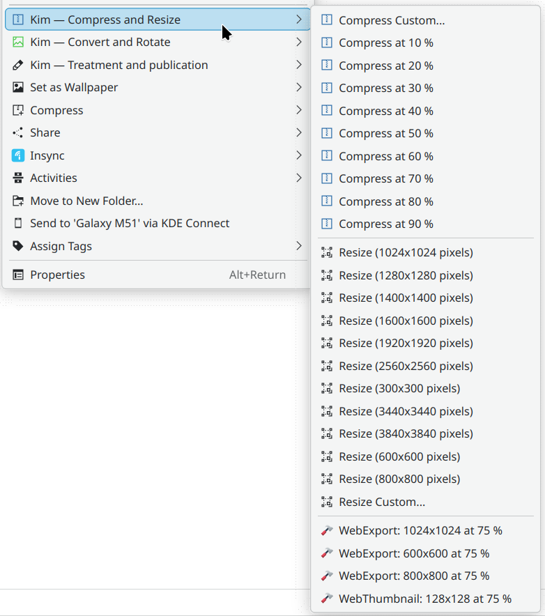

# KDE Image Menu 6 — KIM6
KIM6 is a service menu for the KDE Plasma desktop. It adds context-menu actions in Dolphin and Folder View so you can resize, convert and batch-process images (and some video formats) directly from the file manager.

KDE store: https://store.kde.org/p/2307290/

## Dependencies, Install, Uninstall
See [INSTALL.md](INSTALL.md).

## Usage and Features
See the manual: https://kim-6.github.io/kim6/

## Development and contributing translations
See [DEVELOPMENT.md](DEVELOPMENT.md).
All contributions are welcome!

## History
- KIM6 is a fork for KDE 6 of KIM5: https://github.com/caco3/kim5
- One KDE4 fork is here: https://store.kde.org/p/998188/
- The original version for KDE4 is here: https://store.kde.org/p/1126887/
- KIM itself goes as far back as KDE 3. There is a website that was still functioning in 2026: http://bouveyron.free.fr/kim/index.html
- A huge majority of the code is from the original authors, thanks to them, and also to the forkers for each succesibe KDE version.

Therefore, KIM6’s history goes as far back as some time around 2004 and most of the scripts come from around then. They still work well, but some features can therefore be a bit funky, especially in the publication menu.

## See also
There is a functionally similar but independent project: https://github.com/irfanhakim-as/kde-service-menu-reimage

## Licence
KIM6 is licensed under [GPLv3 or later](LICENSE.md).
